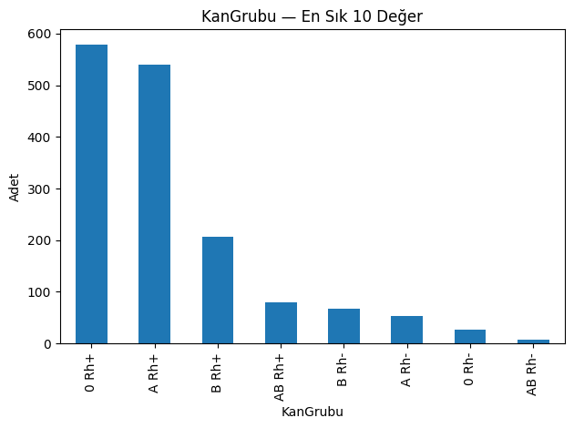

# EDA ve Ön-İşleme Raporu

**Ad Soyad:** Dilek Yılmaz  
**E-posta:** dilekyilmaz000@gmail.com  

---

1. Veri Seti Özeti
- Gözlem sayısı (ham veri): **2235**  
- Sütun sayısı (ham veri): **13**  
- Hedef değişken: **TedaviSuresi**  
- Kaynak dosya: `Talent_Academy_Case_DT_2025.xlsx`

### Ham Veri Sütunları
- HastaNo → int (kimlik)  
- Yas → int  
- Cinsiyet → object (kategori)  
- KanGrubu → object (kategori)  
- Uyruk → object (kategori)  
- KronikHastalik → object (multi-label string)  
- Bolum → object (kategori)  
- Alerji → object (multi-label string)  
- Tanilar → object (multi-label string)  
- TedaviAdi → object (kategori)  
- TedaviSuresi → object (“5 Seans” gibi string)  
- UygulamaYerleri → object (multi-label string)  
- UygulamaSuresi → int  

---

2. Ham Veri Üzerinde EDA

### 2.1 Eksik Değerler

- Alerji: 944  
- KanGrubu: 675  
- KronikHastalik: 611  
- UygulamaYerleri: 221  
- Cinsiyet: 169  
- Tanilar: 75  
- Bolum: 11  
- Diğer kolonlarda eksik yok.  

**Yorum:** Eksikler özellikle kategorik ve multi-label alanlarda yoğunlaşmaktadır.  

### 2.2 Hedef Değişken
- Orijinal format: “5 Seans”, “15 Seans” → string.  
- Doğrudan analiz edilemedi, preprocessing aşamasında sayısallaştırıldı.  

### 2.3 Kategorik Değişkenler
  
**Yorum:** Kadın %57, Erkek %35, Eksik %8.  

  
**Yorum:** En sık 0 Rh+ ve A Rh+, eksik %30.  

  
**Yorum:** Fiziksel Tıp ve Rehabilitasyon baskındır.  

  
**Yorum:** En sık uygulamalar Dorsalji, İV Disk Bozukluğu ve Gonartroz.  

### 2.4 Multi-Label Alanlar
- Yazım farklılıkları mevcut (örn. “Polen” ve “POLEN”).  
- Normalize edilmesi gerektiği görüldü.  

  
**Yorum:** En sık görülenler Aritmi, Hipotiroidizm, Astım ve Diyabet.  

  
**Yorum:** Çoğunluk “Yok”, en yaygın alerjiler polen, toz ve bazı ilaçlardır.  

  
**Yorum:** En sık tanılar Dorsalji, Diğer, Tanımlanmamış; ayrıca disk bozuklukları öne çıkmaktadır.  

  
**Yorum:** En çok bel, boyun ve diz bölgelerinde uygulama yapılmıştır.  

---

3. Ön-İşleme Adımları

Bu adımlar `src/preprocess.py` dosyasında uygulanmıştır:

1. **Eksik Doldurma**  
   - Cinsiyet, KanGrubu, Bolum → en sık değer.  
   - Alerji → boşlar “Yok”.  
   - KronikHastalik, Tanilar, UygulamaYerleri → boş liste.  

2. **Dönüşüm**  
   - `TedaviSuresi` → regex ile sayı çıkarıldı → sayısal sütun.  
   - Kategorikler → OneHotEncoder.  
   - Multi-label sütunlar → dummy sütunlara genişletildi.  

3. **Ölçekleme**  
   - Yas → StandardScaler.  
   - Multi-label dummy sütunlar → binary passthrough (ölçeklenmedi).  

4. **Çıktılar**  
   - `clean_dataset.parquet`  
   - Opsiyonel: `train.parquet`, `valid.parquet`  
   - Pipeline: `preprocessor.joblib`  
   - EDA özet CSV’leri: `eda_outputs/`  

---

4. Temizlenmiş Veri Kontrolleri

- Boyut: **2235 × 631**  
- Eksik değer: **0**  
- Hedef sütun: `__target__TedaviSuresi` → sayısal.  

### 4.1 Hedef Değişken
- 15 seans: 1670 vaka (~%75)  
- 10 seans: 175 vaka  
- Diğer değerler düşük frekansta → veri **dengesiz**.  

### 4.2 Kronik Hastalıklar
En sık: Aritmi, Hipotiroidizm, Astım, Diyabet.  
Kalp-damar ve endokrin hastalıkları öne çıkmaktadır.  

### 4.3 Alerjiler
Çoğunluk: “Yok” (944 vaka).  
En sık alerjiler: Polen, Toz.  
İlaç alerjileri: Novalgin, Arveles, Coraspin.  

### 4.4 Tanılar
En sık: Dorsalji, Diğer, Tanımlanmamış.  
Kas-iskelet sistemiyle ilişkili disk bozuklukları öne çıkmaktadır.  

### 4.5 Uygulama Yerleri
En sık bölgeler: Bel, Boyun, Diz.  
Omuz bölgeleri de önemli paya sahiptir.  

---

5. Genel Sonuç

- **Ham veri**: eksikler, string formatlı hedef ve normalize edilmemiş multi-label kolonlar içeriyordu.  
- **Ön-işleme sonrası**: eksikler giderildi, hedef sayısallaştırıldı, kategorikler encode edildi, multi-label kolonlar binary sütunlara genişletildi.  
- **Temiz veri seti**: eksiksiz, tutarlı ve modellemeye hazır hale geldi.  

**Son yorum:**  
> Tedavi süresi büyük oranda 15 seans etrafında yoğunlaşmıştır. Kronik hastalıklar arasında kalp-damar ve endokrin hastalıkları öne çıkmaktadır. Alerjilerde çoğunluk “Yok” olsa da polen, toz ve bazı ilaç alerjileri sık görülmektedir. Tanılar bel-boyun kaynaklı sorunlarda yoğunlaşmış, uygulama yerleri en çok bel, boyun ve diz bölgeleridir.  
